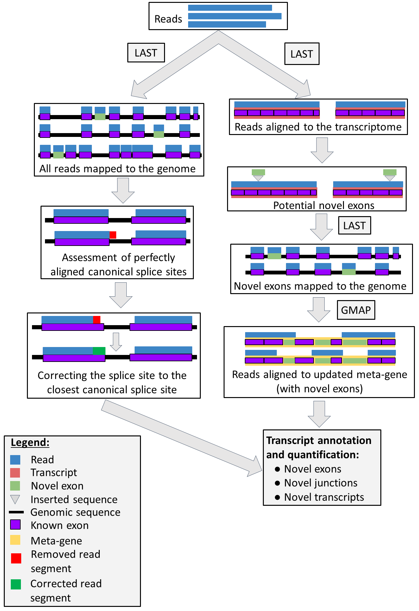

################
General concepts
################

The pipeline comprise of five Snakemake files depending on the user demands. The whole pipeline is depicted on Figure 1.

.. _figure1:

  Pipeline concept

The pipeline comprise of two different sub-workflows: **exon-based** (right-hand side of the figure) and **splice-site-based** (left-hand side of the figure). In the exon-based method, the pipeline annotates novel exons and novel transcript variants, using a known set of exons. It also quantifies reads aligned to obtained annotations after TMM normalisation (after filtering). In the splice-site-based methos, the pipeline identifies abundant canonical splice sites from read alignment to the genome. Particularly, it firstly annotates the perfectly aligned canonical splice sites (i.e. without removing any bases from reads at the splice breakpoint) and corrects every read to abundant canonical splice sites.

***************
What TAQLoRe is
***************

- It is a versatile tool to **IMPROVE** existing annotations (i.e. discovering novel exons, annotating exon skipping events)
- It is 'good enough' to quantify all transcripts, provided roughly equal number of reads in all samples
- It can annotate alternative splice sites although quantification step is less acurate than in the exon-level-based part of the pipeline

*******************
What TAQLoRe is not
*******************

- It is not a tool to generate *de-novo* assembly of transcripts
- It is not a tool which works for the whole transcriptome (e.g. ONT direct RNA-Seq)
- It is not a tool to work without existing annotation
- It is not a tool to annotate non-canonical splice sites
- It is not a tool to annotate alternative UTRs and/or transcription start sites

*******************
Exon-based pipeline
*******************

Exon-based pipeline (right-hand side of the figure with :ref:`figure1`) can be used to obtain a high confidence annotation by annotating novel exons and using already known alternative splice sites to annotate and quantify all transcripts. It is split into three Snakefiles (part1-part3).

Part 1
======

The first part of the pipeline comprises of following steps:

1. Creating a transcriptome index.
2. Obtaining substitution rates from FASTA file with last-train.
3. Mapping reads to the reference transcriptome with LAST.
4. Obtaining novel exons from insertions in the reads (between exons).
5. Mapping novel exons to the genome, to obtain their exact genomic positions.
6. Filtering out alignments outside the gene of interest.
7. Generating a per-sample and merged BedGraph files with read counts aligned to novel exons.
8. Creating a file with meta-gene annotation.

After the Part 1 of the pipeline the user is expected to annotate UTRs in the file as UTRs should be ommited in the annotation. For more details see :ref:`after_part1`.

Part 2
======

The second part of the pipeline starts with meta-gene annotation file with annotated UTRs in the last column. Next steps are:

1. Creating a BED file with all the exons.
2. Generating FASTA file of the whole meta-gene.
3. Building GMAP index.
4. Aligning all the reads to the meta-gene.
5. Counting splicing patterns of all reads.
6. Removing exons covered by low number of reads.
7. Removing reads containing removed exons.
8. Downweighting reads that can be mapped to more than one transcript.
9. Creating a histogram of reads per sample.
10. Filtering out transcripts with low abundance.
11. TMM normalisation of read counts.
12. Creating expression heatmaps.
13. Creating PCA plots, transcripts explaining first three PCs, correlations between first three PCs and read numbers.
14. Creating annotation table with coding status.
15. Creating BED12 files with all transcripts.
16. FASTA files with coding and non-coding transcripts' nucleotide sequences, together with sequences of transcripts containing novel exons.
17. Annotation table and FASTA files with nucleotide sequences for transcripts containing exon skipping events.

Part 3
======

Third part of the pipeline can be ran if there is a huge bias for read numbers (in the magnitude of 1000s) between different samples (which can be observed in the correlation plot generated at step no. 13 of Part 2). It starts with the splicing patterns of each read per sample. The steps of this part of the pipeline are:

1. Downsampling the splicing patterns per read in all samples.
2. Removing exons covered by low number of reads.
3. Removing reads containing removed exons.
4. Downweighting reads that can be mapped to more than one transcript.
5. Creating a histogram of reads per sample.
6. Filtering out transcripts with low abundance.
7. TMM normalisation of read counts.
8. Creating expression heatmaps.
9. Creating PCA plots, transcripts explaining first three PCs, correlations between first three PCs and read numbers.
10. Creating annotation table with coding status.
11. Creating BED12 files with all transcripts.
12. FASTA files with coding and non-coding transcripts' nucleotide sequences, together with sequences of transcripts containing novel exons.
13. Annotation table and FASTA files with nucleotide sequences for transcripts containing exon skipping events.

**************************
Splice-site-based pipeline
**************************

Splice-site-based pipeline (left side of the :ref:`figure1`) can be used to annotate abundant canonical splice sites. Because of relatively high error rate in long read sequencing technologies (especially Oxford Nanopore), quantification of obtained transcripts may be less accurate, nevertheless transcript order (from the most to the least abundant) should be preserved. The pipeline is split to two files (part4 and part5).

Part 4
======

This part is the complete pipeline to annotate and quantify alternative splice sites in all samples. Steps of this part of the pipeline comprise of:

1. Creating a genome index (with LAST).
2. Obtaining substitution rates from FASTA file with last-train.
3. Mapping reads to the reference genome with LAST.
4. Parsing alignments to separate aligned from unaligned parts of reads and to generate chromosomal positions of each exon.
5. Assessment of perfectly aligned splice sites.
6. Correcting reads to canonical splice sites (with different thresholds).
7. Creating a file with transcript names and sequences.
8. Downweighting multi-mapped reads.
9. Creating a histogram of reads per sample.
10. Filtering out transcripts with low abundance.
11. TMM normalisation of read counts (removing transcripts with geometric mean equal to zero, as well as adding 10^-6 to all downweighted counts).
12. Creating expression heatmaps.
13. Creating PCA plots, transcripts explaining first three PCs, correlations between first three PCs and read numbers (with native and log2-transformed expression values).
14. Creating annotation table with coding status.
15. Creating BED12 files with all transcripts.
16. Comparison between two approaches.

Part 5
======

The last part of the pipeline can be ran if there is a huge bias for read numbers (in the magnitude of 1000s) between different samples (which can be observed in the correlation plot generated at step no. 3 of Part 2). It starts with corrected reads. The steps of this part of the pipeline are:

1. Downsampling corrected reads.
2. Downweighting multi-mapped reads.
3. Creating a histogram of reads per sample.
4. Filtering out transcripts with low abundance.
5. TMM normalisation of read counts (removing transcripts with geometric mean equal to zero, as well as adding 10^-6 to all downweighted counts).
6. Creating expression heatmaps.
7. Creating PCA plots, transcripts explaining first three PCs, correlations between first three PCs and read numbers (with native and log2-transformed expression values).
8. Creating annotation table with coding status.
9. Creating BED12 files with all transcripts.
10. BedGraph file with annotation counts.
